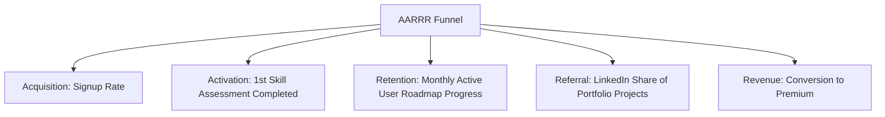

# Product Discovery: LifeGuide AI

**AI-Powered Career & Learning Copilot**

---

## 1. Problem Statement

The gap between academic/self-guided learning and the actual skills required by the modern, rapidly changing job market is at an all-time high. Aspiring professionals (students, job seekers, and career changers) face severe **choice paralysis** due to an overwhelming abundance of online educational resources, yet they lack objective ways to identify their exact skill gaps, build high-impact portfolios, and validate their readiness for target roles.

---

## 2. Existing Problems in the Market

- **Information Overload:** Learners are flooded with generic courses on platforms like Coursera, Udemy, and YouTube, making it difficult to identify high-quality, relevant content.
- **Lack of Personalization:** Curriculums are rigid, standardized, and fail to adapt to a learner's existing background, time constraints, or specific target job descriptions.
- **The "Cookie-Cutter Portfolio" Problem:** Bootcamps and online tutorials produce thousands of candidates with identical portfolio projects (e.g., Todo lists, basic e-commerce clones), which fail to stand out to recruiters.
- **Isolation and Lack of Feedback:** Independent learners study in a vacuum without objective feedback on their resume strength, coding standards, project architecture, or interview performance.
- **Hyper-Paced Skill Evolution:** Job market demands shift faster than traditional educational institutes can update their curriculum, leaving students with obsolete knowledge.

---

## 3. Why Current Solutions Fail

- **Traditional Higher Education:** Extremely high cost, multi-year commitments, and a heavy focus on academic theory over modern, practical application.
- **Standard MOOCs & E-Learning Platforms:** High dropout rates (often >90%) because they offer passive video consumption, lack accountability, and do not bridge the gap to actual placement.
- **Coding & Career Bootcamps:** Prohibitively expensive ($10,000+), require full-time commitments, and apply a rigid, one-size-fits-all timeline.
- **Generic AI Chatbots (ChatGPT / Claude):** While helpful for ad-hoc questions, they do not offer structured progression tracking, interactive evaluation pipelines, integration with live job listings, or verifiable skill scorecards.

---

## 4. Product Mission

> To democratize career navigation and skill validation, providing every learner with an accessible, highly personalized, AI-driven copilot that bridges the gap between ambition and employment.

---

## 5. Product Vision

> To become the global standard for personalized professional growth and verified skill competency, empowering individuals to navigate career transitions with confidence and clarity.

---

## 6. Core Value Proposition

LifeGuide AI transforms career uncertainty into a structured, executable roadmap. It serves as an active career coach that:

1. **Assesses** current skills objectively through short, contextual evaluations.
2. **Maps** an optimized, hyper-personalized learning path directly to live job descriptions.
3. **Generates** unique, non-trivial portfolio projects tailored to the learner's skill gap.
4. **Validates** job readiness using interactive, AI-powered mock interviews and resume optimizations.

---

## 7. Target Users

- **University & College Students:** Seeking to supplement their theoretical degrees with real-world skills and build a portfolio to secure internships or entry-level positions.
- **Job Seekers (Unemployed/Underemployed):** Actively applying for roles who need to quickly identify why their resumes are rejected, close immediate skill gaps, and practice interview loops.
- **Career Changers:** Working professionals transitioning from non-technical roles (e.g., sales, operations) into high-demand areas like Software Engineering, Data Science, or Product Management.

---

## 8. User Personas

| Persona                              | Context & Background                                                                                            | Core Goals                                                                              | Core Frustrations                                                                                                                |
| :----------------------------------- | :-------------------------------------------------------------------------------------------------------------- | :-------------------------------------------------------------------------------------- | :------------------------------------------------------------------------------------------------------------------------------- |
| **Maimuna (21)**  _CS Student_    | Final-year Computer Science student with good academic grades but no real-world internship experience.          | Land a Frontend Engineer internship; build a stand-out portfolio.                       | University courses are too theoretical; doesn't know how to stand out from thousands of other graduates.                         |
| **Kamal (32)**  _Career Changer_  | Currently a Retail Store Manager with a business background, self-studying to transition to Product Management. | Transition to a Junior PM role within 6 months while working full-time.                 | Extremely limited study time; doesn't know how to translate retail experience into PM terminology; overwhelmed by PM frameworks. |
| **Aisha (26)**  _Self-Taught Dev_ | Self-studying Frontend Development for 9 months via YouTube and free code platforms.                            | Pass the resume screening phase and overcome imposter syndrome in technical interviews. | Receives automated rejection emails with no feedback; lacks confidence in explaining architectural choices.                      |

---

## 9. User Pain Points

- **"Where do I start?"** Overwhelm and choice paralysis when looking at a new industry or technology.
- **Wasted Effort:** Spending months studying libraries or concepts that are irrelevant or rarely requested by local employers.
- **Low Resume Response:** Applying to dozens of jobs online with absolute silence, and no feedback on what skills are missing.
- **Imposter Syndrome:** Deep anxiety regarding technical interview formats, coding assessments, or behavioral questions.
- **Portfolio Homogeneity:** Having portfolio projects that look identical to every other candidate, leading to low recruiter interest.

---

## 10. User Goals

- **Structured Roadmap:** Access a step-by-step learning checklist based on current market demands.
- **Resume-Worthy Projects:** Build and deploy unique, complex applications that prove competence.
- **Objective Readiness Score:** Understand exactly when they are "market-ready" based on objective metrics.
- **Interview Success:** Pass the interview loop and land a job with confidence.

---

## 11. Real-world Use Cases

- **Use Case 1: Gap Assessment via Target Job Link**
  - _Flow:_ Elena pastes a link to a Junior React Developer job description. LifeGuide AI parses the description, compares it against her uploaded resume, and highlights that she lacks experience with state management libraries (Redux/Zustand) and testing (Jest).
- **Use Case 2: Custom Project Brief Generation**
  - _Flow:_ Marcus requests a project idea to showcase product strategy. LifeGuide AI generates a custom, detailed product specification brief: "Design a feature for a ride-sharing app to increase driver retention during off-peak hours," complete with user personas, metric frameworks, and mock wireframe briefs.
- **Use Case 3: Interactive Mock Interview Practice**
  - _Flow:_ Sarah starts an interactive tech interview session for a frontend role. The AI interviewer presents her with a coding scenario, evaluates her step-by-step reasoning, and yields a detailed scorecard highlighting where she did well and what concepts she needs to review.
- **Use Case 4: Adaptive Roadmap Re-routing**
  - _Flow:_ A learner realizes they only have 6 hours per week instead of 15. The AI re-calibrates their roadmap, focuses only on critical path skills, and extends the completion target dynamically.

---

## 12. Benefits for Users

- **Accelerated Time-to-Job:** Focuses learning solely on high-yield skills, reducing job transition time by up to 50%.
- **Cost Efficiency:** Provides a high-fidelity learning experience at a fraction of the cost of bootcamps or private career coaches.
- **Hyper-Relevant Portfolios:** Ensures learners build unique projects that naturally prompt deep conversations during interviews.
- **Continuous Feedback:** Offers safe, repeatable, and non-judgmental environments to practice and fail before real-world interviews.

---

## 13. Business Opportunities

- **B2C Premium Subscription (SaaS):** Monthly/yearly subscription tier giving users unlimited personalized roadmaps, project generator briefs, resume match analysis, and interactive AI mock interviews.
- **B2B2C Partnerships (Higher Ed / Bootcamps):** Institutional licenses for universities and bootcamps to track student progress, assess job-readiness, and increase placement rates.
- **Recruiter & Hiring Platform (Long-Term):** Charging companies to access a vetted talent pool of candidates who have verified competency scores and AI-validated portfolios.
- **Targeted Upskilling Affiliate Revenue:** Partnering with specialized course creators or certificate providers to suggest high-quality courses when a user needs to close a specific skill gap.

---

## 14. Competitive Advantage

- **Live Job-Market Alignment:** Unlike static paths (e.g., roadmap.sh), LifeGuide AI aligns your learning path dynamically with real-time job postings.
- **Context-Aware Project Spec Generator:** Instead of listing titles (e.g., "Build a weather app"), it generates distinct, multi-layered system specifications that emulate real-world business challenges.
- **End-to-End Career Loop:** Integrates assessment, learning, building, and interview preparation into a single cohesive feedback loop rather than forcing users to stitch together separate platforms.

---

## 15. MVP Scope

- **Interactive Skill Profiler:** A text-based assessment module evaluating competencies for three initial career tracks (Frontend, Backend, and Product Management).
- **AI Roadmap Generator:** Generates custom weekly learning roadmaps linked to high-quality, curated, free resources (official docs, YouTube, articles).
- **Personalized Project Brief Generator:** Creates unique project specifications tailored to the user's target role and current skill level.
- **Resume Analyzer & Job Matcher:** Simple PDF resume parsing compared against a pasted job description to output a compatibility score and a list of missing keywords.

---

## 16. Future Scope

- **Voice-First AI Interview Coach:** Audio-based technical and behavioral mock interview sessions that evaluate speaking pace, tone, and logic.
- **Collaborative Squad Projects:** Matching users of complementary skills (e.g., one Backend developer, one Frontend developer, one PM) to collaborate on multi-disciplinary projects.
- **Automated GitHub Portfolio Audit:** Deep scanning of a user's GitHub repositories to analyze code quality, structure, testing practices, and automatically suggest improvements.
- **Verified Talent Marketplace:** Allowing recruiters to post roles and instantly discover candidates with verified matching skill scores.

---

## 17. Risks & Mitigations

> [!WARNING]
> **Risk 1: AI Hallucinations & Obsolete Code Recommendations**
>
> - _Mitigation:_ Limit learning roadmaps to link to official documentation domains and establish an internal repository of verified, high-quality resources.

> [!IMPORTANT]
> **Risk 2: Churn After Landing a Job**
>
> - _Mitigation:_ Design "On-the-Job Copilot" features (e.g., "How to pass your probation," "Preparing for your first promo," "Handling mid-level tech leadership").

> [!CAUTION]
> **Risk 3: Competition from Established Players (e.g., LinkedIn, Coursera)**
>
> - _Mitigation:_ Focus heavily on the customized "portfolio project building" and "mock interview" niche, which requires deep vertical integration that horizontal platforms struggle to prioritize.

---

## 18. Success Metrics

### Core Product KPIs

1. **Activation Rate:** % of new signups that complete their first skill assessment profile within 24 hours (Target: > 70%).
2. **Weekly Engagement Rate:** % of users who mark at least 2 learning milestones as complete per week (Target: > 45%).
3. **Mock Interview Completion:** Average number of mock interviews completed per user before real applications (Target: 3+).
4. **Employment Success Rate:** % of premium users who land a role or advance in their career within 180 days of platform usage (Target: > 60%).
5. **NPS (Net Promoter Score):** Monthly target score (Target: > 50).
