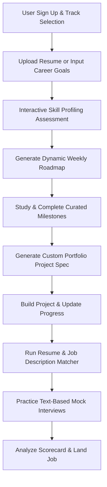

# Product Requirements Document (PRD): LifeGuide AI

**Project Name:** LifeGuide AI – Career & Learning Copilot  
**Author:** Principal Product Manager & Senior Software Architect, Google  
**Date:** July 18, 2026  
**Document Status:** Approved (Ready for Implementation)

---

## 1. Product Overview

LifeGuide AI is an AI-powered Career and Learning Copilot designed to bridge the growing gap between academic/self-guided education and real-world employment demands. The platform targets students, job seekers, and career changers facing choice paralysis from the abundance of online learning content.

By offering personalized profiling, dynamic learning paths aligned to live job descriptions, custom portfolio project generation, and interactive career validation tools, LifeGuide AI transforms career transitions into structured, executable, and objective roadmaps.

---

## 2. Business Goal

- **Establish Product-Market Fit (PMF):** Successfully launch and validate the platform across three initial high-demand career tracks: Frontend Engineering, Backend Engineering, and Product Management.
- **Drive User Engagement & Retention:** Achieve high user activation and consistent weekly progression metrics to demonstrate educational efficacy.
- **Monetization Readiness:** Establish a B2C premium subscription model (unlimited roadmap generation, customized project specs, advanced mock interviews, and resume analysis) with a targeted conversion rate of >3%.
- **Build Proprietary Competence:** Develop a repeatable, AI-driven competency mapping engine to support future B2B institutional licensing (universities/bootcamps) and recruiter platforms.

---

## 3. User Types

1. **University & College Students:** final-year or recent graduates who possess theoretical knowledge but lack real-world internship experience and high-impact portfolios to stand out.
2. **Job Seekers (Unemployed/Underemployed):** Individuals actively applying for roles who face high rejection rates, need to identify skill gaps, optimize their resumes, and build confidence for interview loops.
3. **Career Changers:** Working professionals transitioning from non-technical roles (e.g., retail, sales, operations) into technology fields, constrained by limited study time (typically <10 hours/week) and needing structured focus.

---

## 4. User Stories

- **US-1 (Skill Gap Profiling):** As a **University Student**, I want to select my target career track and complete a brief diagnostic assessment, so that I can discover my baseline skill levels and identify immediate gaps.
- **US-2 (Targeted Job Alignment):** As a **Job Seeker**, I want to paste a link to a specific job description, so that the AI can compare it against my current profile and list the exact skills I am missing.
- **US-3 (Dynamic Learning Roadmap):** As a **Career Changer** with limited hours, I want a structured weekly learning schedule with curated free resources that updates dynamically if my weekly availability changes, so that I can learn efficiently without getting overwhelmed.
- **US-4 (Custom Portfolio Specs):** As a **Self-Taught Developer**, I want the AI to generate a detailed, non-trivial, custom portfolio project specification based on my skill gaps, so that I can build a unique application that proves my engineering capability to recruiters.
- **US-5 (Resume Match Scorecard):** As a **Job Seeker**, I want to upload my PDF resume and compare it against a target job description, so that I can receive a matching score, missing keywords, and recommendations to pass Applicant Tracking Systems (ATS).
- **US-6 (Mock Interview Practice):** As a **User**, I want to conduct an interactive text-based mock interview for my target track and receive a detailed evaluation scorecard, so that I can practice articulating technical concepts and identify areas of weakness before real interviews.

---

## 5. Functional Requirements

### 5.1. Interactive Skill Profiler

- **Baseline Diagnostics:** The system must support text or multiple-choice assessments for three launch tracks: Frontend, Backend, and Product Management.
- **Profile Creation:** The system must record and save the user's current competency levels across core sub-skills (e.g., React, SQL, Product Strategy) into a unified profile.

### 5.2. AI Roadmap & Schedule Generator

- **Personalized Curation:** The system must generate step-by-step learning roadmaps containing target milestones and verified external reference links (e.g., official docs, tutorials, high-quality videos).
- **Dynamic Recalibration:** The system must allow users to input weekly available study hours and adaptively adjust the roadmap duration and milestone density.

### 5.3. Personalized Project Brief Generator

- **Unique Architecture Specs:** The system must generate custom project briefs containing a clear business case, functional requirements, technical architecture suggestions, and implementation milestones.
- **Context-Driven Challenge:** The project specifications must actively target the specific skill gaps identified in the user's profile, avoiding generic "cookie-cutter" templates.

### 5.4. Resume Analyzer & Job Matcher

- **Document Parsing:** The system must parse PDF resumes to extract skills, experience, and educational metadata.
- **ATS Compatibility Scoring:** The system must compare the resume text against a provided job description (pasted text or URL) and calculate a percentage match score (0-100%).
- **Gap Analysis Reporting:** The system must highlight missing keywords, soft/hard skills, and outline clear action items to optimize the resume.

### 5.5. Mock Interview Simulator

- **Interactive Conversational Loop:** The system must run a multi-turn, text-based interactive chat interface simulating a real technical or behavioral interview.
- **Evaluation Scorecard:** Upon completion, the system must generate a performance report detailing communication clarity, technical correctness, structural feedback, and recommended study areas.

---

## 6. Non-Functional Requirements

### 6.1. Performance & Latency

- **Page Load Times:** The web application must load in under 3.0 seconds under normal network conditions.
- **AI Generation Time:** Large AI-generated outputs (such as customized roadmaps and project briefs) must start streaming or return a completed response in under 5.0 seconds.

### 6.2. Security & Compliance

- **Data Privacy:** Resume documents and personal identification information (PII) must be stored securely and processed in compliance with GDPR and CCPA.
- **Secure Authentication:** The platform must support secure user authentication via Google and GitHub OAuth SSO.

### 6.3. Scalability & Availability

- **Uptime:** The platform must maintain a minimum of 99.9% service availability.
- **API Rate Limiting:** The platform must implement rate-limiting rules on AI endpoints to protect backend services from abuse and control operational costs.

### 6.4. Accessibility

- **WCAG Compliance:** The user interface must conform to WCAG 2.1 Level AA accessibility standards, ensuring compatibility with screen readers and keyboard-only navigation.

---

## 7. Core Features (MVP Only)

1. **Interactive Skill Profiler:** Core questionnaire assessment for Frontend, Backend, and Product Management tracks.
2. **AI Roadmap Generator:** Dynamic weekly learning schedule mapping target roles to curated free educational resources.
3. **Personalized Project Brief Generator:** Context-aware, custom project briefs designed to fill the user's specific skill gaps.
4. **Resume Analyzer & Job Matcher:** PDF resume comparison against pasted job descriptions with ATS matching scores and gap feedback.
5. **Mock Interview Simulator:** Interactive, text-based conversational loop resulting in a competency-based scorecard.

---

## 8. Out of Scope (Version 2)

- **Voice-First AI Interview Coach:** Audio/speech-based mock interviews tracking voice tone, pacing, and verbal filler usage.
- **Collaborative Squad Projects:** Matching users (e.g., 1 PM, 1 Frontend, 1 Backend) to build cross-functional team projects.
- **Automated GitHub Portfolio Audit:** Directly scanning GitHub repositories to evaluate code quality, structure, unit tests, and performance.
- **Verified Talent Marketplace:** Recruiter-facing dashboard to search and source candidates based on verified skills and project evaluations.
- **B2B Enterprise Dashboards:** Class and cohort analytics for universities, colleges, and bootcamps.

---

## 9. User Journey

1. **Onboarding & Profiling:** The user signs up, selects their desired track (e.g., Frontend Developer), and uploads their resume or input objectives.
2. **Diagnostic Evaluation:** The user completes a brief assessment to determine baseline competencies.
3. **Learning Path Setup:** The user receives a personalized, weekly roadmap structured around their weekly hourly constraints.
4. **Competency Building:** The user studies curated resources and completes learning milestones.
5. **Project Execution:** The user requests and builds a custom, gap-focused portfolio project based on the generated design specifications.
6. **Career Readiness & Practice:** The user checks their resume compatibility against target roles and practices technical mock interviews.
7. **Job Application:** The user applies to roles with a verified portfolio, optimized resume, and high interview confidence.

---

## 10. Acceptance Criteria

### 10.1. Interactive Skill Profiler

- **AC-1:** When a user selects one of the 3 tracks, the system must present a diagnostic assessment comprising 5 to 10 context-specific questions.
- **AC-2:** Upon completing the assessment, the user's profile must immediately save the calculated competency level (Novice, Intermediate, Advanced) for each tested skill.

### 10.2. AI Roadmap Generator

- **AC-1:** Given a target role and user profile, the roadmap must include at least 1 curated, functional external learning resource link per week.
- **AC-2:** When a user modifies their weekly study hours, the system must adjust the roadmap length (e.g., from 4 weeks to 8 weeks) and re-distribute milestones without losing current progress.

### 10.3. Personalized Project Brief Generator

- **AC-1:** The generated brief must contain: Project Title, User Persona, Core Functional Requirements, Recommended Tech Stack, and Phase-by-Phase Milestones.
- **AC-2:** The brief must explicitly state which target skill gap (from the user's profile) the project is designed to evaluate and strengthen.

### 10.4. Resume Analyzer & Job Matcher

- **AC-1:** The parser must support uploading files up to 5MB in PDF format and extract readable text content.
- **AC-2:** The comparison output must deliver: A percentage score (0-100%), a list of missing keywords found in the job description but not the resume, and a list of actionable bullet point improvements.

### 10.5. Mock Interview Simulator

- **AC-1:** The chat interface must support a minimum of 5 dialogue turns between the user and the AI interviewer before concluding the session.
- **AC-2:** The generated scorecard must score the user out of 100 on 3 core criteria: Communication, Technical Accuracy, and Problem Solving, accompanied by specific feedback for each.

---

## 11. Success Metrics

### 11.1. Core Product KPIs (AARRR Model)

- **Acquisition:** Signup Conversion Rate: >15% of landing page visitors register for an account.
- **Activation:** Profiling Completion Rate: >70% of registered users complete their first diagnostic assessment within 24 hours of onboarding.
- **Retention:** Milestone Completion Rate: >45% of weekly active users (WAU) mark at least 2 roadmap milestones as complete per week.
- **Referral:** Social Sharing Rate: >10% of users share their custom portfolio project achievements or mock interview scorecards on LinkedIn.
- **Revenue:** Trial-to-Paid Conversion Rate: >3% of active free users upgrade to the premium subscription tier.

### 11.2. Quality & Outcome Metrics

- **Employment Success Rate:** >60% of premium users secure a relevant job or internship within 180 days of active platform use.
- **Net Promoter Score (NPS):** Maintain an aggregate monthly NPS score of >50.

---

## 12. Assumptions

- **A-1:** Target users have access to a desktop or laptop computer with reliable internet to complete interactive mock interviews and build projects.
- **A-2:** LLMs (such as Gemini Pro) provide sufficient reasoning capability to accurately analyze skill gaps, generate architectural code structures, and evaluate technical interview responses.
- **A-3:** Curated external learning resources (e.g., documentation, YouTube tutorials) will remain publicly accessible, free of charge, and stable over time.
- **A-4:** Users are comfortable uploading their resume PDFs and sharing basic career details to receive personalized career coaching.

---

## 13. Risks

- **R-1 (AI Hallucinations & Outdated Tech):** The AI may recommend deprecated syntax or obsolete libraries.
  - _Mitigation:_ Constrain the AI's resource selection to official documentation domains and establish an internally validated list of trusted learning paths.
- **R-2 (High Operational API Costs):** Running intensive multi-turn chat sessions and long text generations could escalate LLM API costs.
  - _Mitigation:_ Implement caching for common roadmap structures, apply user rate-limiting on high-cost features, and optimize system prompts to reduce token counts.
- **R-3 (Post-Placement User Churn):** Users will naturally stop using the service once they successfully land a job.
  - _Mitigation:_ Develop post-onboarding modules for Version 2 (e.g., "Passing Probation," "Succeeding in your first 90 days," "Fast-tracking promotion cycles") to retain employed users.
- **R-4 (Privacy & Security of Resume Data):** Processing user resumes risks capturing sensitive personal PII.
  - _Mitigation:_ Apply strict data-stripping filters to remove highly sensitive elements (e.g., social security numbers, exact addresses) prior to LLM processing and encrypt data at rest.

---

## 14. Future Enhancements

- **Voice-Based Mock Interviewing:** Upgrade the text-based simulator to a conversational voice interface using advanced Speech-to-Text and Text-to-Speech models.
- **Integrative GitHub Auditing:** Direct repository scanning to assess code quality, test coverage, and documentation standards, feeding directly into the user's readiness scorecard.
- **Collaborative Teams (Squads):** An automated matchmaking system pairing frontend developers, backend developers, and PMs to work together on simulated company sprints.
- **Recruiter Connect Marketplace:** A specialized portal allowing vetted companies to discover, evaluate, and directly interview high-performing users based on verifiable platform benchmarks.
