# Information Architecture (IA): LifeGuide AI

**Project Name:** LifeGuide AI – Career & Learning Copilot  
**Author:** Senior UX Architect & Principal Software Architect  
**Document Status:** Final (MVP Baseline)  
**File Path:** `docs/04-information-architecture.md`

---

This document defines the Information Architecture (IA) for the Minimum Viable Product (MVP) of LifeGuide AI. It structures content, navigation, and user flow hierarchies to ensure a cognitive-load-optimized, high-fidelity experience that helps users identify skill gaps, learn, build custom portfolio projects, optimize resumes, and practice mock interviews.

---

## 1. Sitemap

The sitemap uses a flat, high-proximity dashboard structure to minimize navigation depth. Users are never more than two clicks away from any MVP feature.

```mermaid
graph TD
    %% Nodes
    Root((Root /)) --> Public[Public Namespace]
    Root --> Protected[Protected Namespace /dashboard]

    %% Public Pages
    Public --> Landing[Landing Page /]
    Public --> Auth[Auth Portal /auth]
    Public --> Privacy[Privacy Policy /privacy]
    Public --> Terms[Terms of Service /terms]

    %% Protected Pages
    Protected --> Onboarding[Onboarding Wizard /onboarding]
    Protected --> DashHome[Dashboard Overview /dashboard]
    Protected --> Profiler[Skill Profiler /dashboard/profiler]
    Protected --> Roadmap[Learning Roadmap /dashboard/roadmap]
    Protected --> Project[Project Briefs /dashboard/projects]
    Protected --> Resume[Resume Matcher /dashboard/resume-matcher]
    Protected --> Interview[Mock Interviews /dashboard/mock-interviews]
    Protected --> Settings[Account Settings /dashboard/settings]
    Protected --> Page404[Error Page /404]

    %% Styles
    style Root fill:#1E293B,stroke:#38BDF8,stroke-width:2px,color:#FFF
    style Public fill:#0F172A,stroke:#64748B,stroke-width:1px,color:#94A3B8
    style Protected fill:#0F172A,stroke:#38BDF8,stroke-width:2px,color:#38BDF8
    style Onboarding fill:#1E293B,stroke:#F59E0B,stroke-width:1px,color:#F59E0B
```



---

## 2. Public Pages

Public pages present the core value proposition, capture traffic, and handle initial access control. They are optimized for rapid comprehension and high conversion to registration.

### 2.1. Landing Page (`/`)

- **Objective:** Explain the "Career & Learning Copilot" concept, display the three supported launch tracks (Frontend, Backend, Product Management), and convert visitors to registered users.
- **Key Content Blocks:**
  - **Hero Section:** Value proposition headline, subheadline, and primary CTA ("Start Free Assessment").
  - **MVP Track Matrix:** Interactive visual selector outlining Frontend Engineering, Backend Engineering, and Product Management.
  - **Feature Preview Walkthrough:** Simple structural steps demonstrating the end-to-end user loop: Profiler → Roadmap → Custom Project → Resume Optimization → Mock Interview.
  - **Secondary CTA Banner:** Re-anchoring of registration triggers at the base of the page.

### 2.2. Authentication Portal (`/auth`)

- **Objective:** Clean, secure, and low-friction entry point for account creation and login.
- **Key Content Blocks:**
  - **Single Sign-On (SSO) Triggers:** Integrated Google OAuth and GitHub OAuth SSO buttons.
  - **Legal Disclosure:** Explicit notification that continuing constitutes acceptance of the Terms of Service and Privacy Policy.

### 2.3. Legal Pages (`/privacy` & `/terms`)

- **Objective:** Fulfill compliance and regulatory standards.
- **Key Content Blocks:**
  - **Privacy Policy (`/privacy`):** Standard data management documentation, detailing PDF resume storage limits and LLM data processing rules.
  - **Terms of Service (`/terms`):** Usage rights, service availability commitments, and subscription policies.

---

## 3. Protected Pages

Protected pages house the core dynamic features of LifeGuide AI. Users must be authenticated to access this namespace.

### 3.1. Onboarding Wizard (`/onboarding`)

- **Objective:** Fast-track new user setup and construct the baseline profile.
- **Onboarding Steps (Linear Workflow):**
  1. **Select Career Track:** Choose one target launch track (Frontend, Backend, or Product Management).
  2. **Set Weekly Commitment:** Input available study hours (slider range: 1 to 40 hours/week).
  3. **Establish Profile Background:** Upload PDF resume (for extraction) or input target career goals text.
  4. **Diagnostic Invitation:** Display a clean call-to-action inviting users to begin their baseline skill profiling assessment.

### 3.2. Dashboard Overview (`/dashboard`)

- **Objective:** Central command center summarizing status, metrics, and quick actions.
- **Key Content Blocks:**
  - **Status & Metrics Header:** Current active track, total roadmap progress percentage bar, and active learning streak count (in days).
  - **Target Goal Action Panel:** Dynamic card displaying the immediate next milestone due on the user's roadmap.
  - **Quick Feature Launch Cards:** Direct-entry grids mapped to the five core MVP features (Profiler, Roadmap, Project Briefs, Resume Matcher, Mock Interviews).

### 3.3. Skill Profiler (`/dashboard/profiler`)

- **Objective:** Test competency and display the user's current baseline skill ratings.
- **Key Content Blocks:**
  - **Assessment Selector:** Active diagnostic status screen with "Start Diagnostic Assessment" or "Retake Assessment" controls.
  - **Interactive Questionnaire (Modal/Overlay):** A linear presentation of 5-10 track-specific multiple-choice or short-response questions.
  - **Competency Matrix View:** Visual breakdown of sub-skills categorized by rating (Novice, Intermediate, Advanced) across core domain areas (e.g., React, CSS, and State Management for Frontend).

### 3.4. Learning Roadmap (`/dashboard/roadmap`)

- **Objective:** Structure and track learning progress with curated materials.
- **Key Content Blocks:**
  - **Schedule Header:** Milestone overview indicating completion status (e.g., "Week 3 of 6: State Management").
  - **Weekly Timeline View:** Vertical stepper containing:
    - Collapsible weekly modules.
    - Checkboxes to mark milestones complete.
    - Clickable curated study links to external, verified resources (docs, video, articles).
  - **Roadmap Control Bar:** "Adjust Schedule" modal trigger allowing real-time recalibration of weekly hours and roadmap length.

### 3.5. Project Briefs (`/dashboard/projects`)

- **Objective:** House generated custom portfolio projects designed to resolve identified skill gaps.
- **Key Content Blocks:**
  - **Active Project Board:** Card showing the active project description or a prompt to "Generate Custom Brief" if none is active.
  - **Generated Project View:** A structured document split into:
    - **Project Scope:** Title, Target Competency Gap (e.g., "State Management & Testing"), and User Persona.
    - **Technical Blueprint:** Suggested tech stack (e.g., Vite, React, Vitest) and architecture guidelines.
    - **Implementation Phases:** Chronological tasks to guide the user from local repository setup to deployment.
    - **Completion Control:** "Mark Project Completed" action trigger.

### 3.6. Resume Matcher (`/dashboard/resume-matcher`)

- **Objective:** Compare candidate resumes to target job requirements to generate optimization strategies.
- **Key Content Blocks:**
  - **Parser Input Form:** Drag-and-drop file upload zone (accepts PDF, max 5MB) paired with a text input area to paste target Job Description text/URL.
  - **ATS Feedback Interface:** A split-pane results dashboard displaying:
    - **Match Percentage Score:** Circular progress indicator displaying matching level (0-100%).
    - **Keywords Analyzer:** High-contrast tags highlighting missing keywords found in the job description but absent from the resume.
    - **Optimizations List:** Actionable, bulleted recommendations to optimize content for Applicant Tracking Systems.

### 3.7. Mock Interviews (`/dashboard/mock-interviews`)

- **Objective:** Conduct interactive interview preparation loops and evaluate performance.
- **Key Content Blocks:**
  - **Session Setup Panel:** Configuration dashboard specifying target interview type (Technical or Behavioral).
  - **Interactive Chat Arena:** Unified, clean chat layout showing a multi-turn conversation between the user and the AI interviewer (minimum of 5 diagnostic turns).
  - **Performance Scorecard View:** Detailed evaluation scorecard showing:
    - Aggregate score out of 100.
    - Category breakdown (Communication, Technical Accuracy, Problem Solving).
    - Specific positive points and target constructive feedback recommendations.

### 3.8. Account Settings (`/dashboard/settings`)

- **Objective:** User preferences and account management.
- **Key Content Blocks:**
  - **Track Preferences:** Switch target career tracks or update default weekly study hours.
  - **Security Profile:** Manage connected SSO providers (Google/GitHub).
  - **Danger Zone:** Access controls to clear all data or permanently delete the account.

---

## 4. Navbar Navigation

The top navigation bar provides global, persistent utility. It adapts dynamically based on authentication state.

### 4.1. Public Navbar

```
[Logo / Brand]                                      [Supported Tracks]  [About]  [Sign In]
```

- **Brand Logo:** Click to redirect to Landing Page (`/`).
- **Supported Tracks:** Anchor scroll link highlighting Frontend, Backend, and Product Management.
- **About:** Anchor scroll link explaining the product philosophy and MVP value.
- **Sign In (CTA Button):** Primary entry trigger redirecting to the Authentication Portal (`/auth`).

### 4.2. Protected Navbar

```
[Sidebar Toggle]  [Breadcrumbs]                     [Search Bar]  [Notifications]  [User Avatar ▾]
```

- **Sidebar Toggle:** Collapses/expands the left sidebar for workspace screen layout flexibility.
- **Breadcrumb Indicator:** Reflects current location in page nesting (see Section 9).
- **Global Search Input:** Instant accessibility search trigger (see Section 8).
- **Notification Indicator:** Badge alerting users when a diagnostic is pending, a new roadmap has generated, or an interview is completed.
- **User Avatar Dropdown:** Trigger interface to open the User Menu (see Section 6).

---

## 5. Dashboard Sidebar Navigation

The dashboard sidebar acts as the primary navigational anchor for authenticated sessions. It lists the core MVP features in logical order.

```
+----------------------------+
|  LifeGuide AI [Logo]       |
+----------------------------+
|  [🏠] Dashboard Home       |
|                            |
|  LEARNING & ASSESSMENTS    |
|  [📊] Skill Profiler       |
|  [🗺️] Learning Roadmap    |
|                            |
|  PRACTICAL VALIDATION      |
|  [🛠️] Custom Project Specs  |
|  [📄] Resume Matcher       |
|  [💬] Mock Interviews      |
+----------------------------+
|  [⚙️] Settings             |
+----------------------------+
```

- **Dashboard Home:** Quick access home page (`/dashboard`).
- **Skill Profiler:** Navigates to diagnostics and skill grid (`/dashboard/profiler`).
- **Learning Roadmap:** Navigates to step-by-step progress checklists (`/dashboard/roadmap`).
- **Custom Project Specs:** Navigates to the project brief page (`/dashboard/projects`).
- **Resume Matcher:** Navigates to ATS scorecard uploads (`/dashboard/resume-matcher`).
- **Mock Interviews:** Navigates to conversational text chat simulator (`/dashboard/mock-interviews`).
- **Settings:** Navigates to account configurations at the bottom margin (`/dashboard/settings`).

---

## 6. User Menu

The user menu is a unified contextual dropdown attached to the user avatar in the Protected Navbar. It manages profile-specific views and session termination.

- **User Information Block:** Displays User Avatar, Display Name, and Email (e.g., `Maimuna | maimuna@example.com`).
- **Active Track Badge:** High-visibility text block showing the selected target track (e.g., `Active Track: Frontend Engineering`).
- **Menu Items:**
  - **Profile & Settings:** Navigates directly to `/dashboard/settings`.
  - **Divider:** Separation line.
  - **Log Out (Action Link):** Triggers session destruction, invalidates local authorization contexts, and redirects to the public Landing Page (`/`).

---

## 7. Footer Navigation

The footer anchors public validation pages and supports compliance accessibility. To preserve screen real estate and maximize user focus, it is omitted in the protected application namespace.

### 7.1. Public Footer Navigation

```
+--------------------------------------------------------------------------+
|  LifeGuide AI © 2026      |  Tracks: Frontend | Backend | Product Mgmt   |
|                           |  Legal: Privacy Policy | Terms of Service    |
+--------------------------------------------------------------------------+
```

- **Supported Tracks Columns:** Quick links to the tracks section on the landing page.
- **Compliance Links:** Inline anchors to Privacy Policy (`/privacy`) and Terms of Service (`/terms`).
- **Copyright & Origin:** Simple legal ownership statement.

### 7.2. Protected Footer Navigation

- **Omitted:** The authenticated dashboard namespace does not render a standard footer. This maximizes dashboard height, optimizes layout density, and removes secondary navigation links that might pull users out of the learning loop.

---

## 8. Global Search Scope

The global search input, situated in the Protected Navbar, offers rapid, keyboard-accessible navigation to jump directly to specific topics, files, or milestones.

- **Searchable Fields:**
  - **Roadmap Milestones:** Weekly units and learning modules (e.g., searching "Redux" or "SQL Joins" opens the specific week on `/dashboard/roadmap`).
  - **Curated Resources:** External learning documentation names or topics linked in the active roadmap.
  - **Project Briefs:** Titles, tech stacks, or concepts in generated project specifications.
  - **Interview Reports:** Dates or topics of completed mock interviews (e.g., searching "Behavioral" navigates directly to the corresponding mock interview scorecard).
- **UX Interaction Model:**
  - **Hot-Key Activation:** Triggered globally with the `Cmd/Ctrl + K` keyboard shortcut.
  - **Instant Search Dropdown:** Results stream in real-time beneath the input, organized into categorized sections (e.g., "Milestones", "Resources", "Interviews").

---

## 9. Breadcrumb Structure

Breadcrumbs are rendered in the Protected Navbar to show hierarchy, establish visual anchors, and allow quick upward navigation.

| Current View / Location | Breadcrumb Path                | Click Target Rules                                                 |
| :---------------------- | :----------------------------- | :----------------------------------------------------------------- |
| **Dashboard Overview**  | `Dashboard`                    | Direct link to `/dashboard` (inactive state on this page).         |
| **Skill Profiler**      | `Dashboard / Skill Profiler`   | `Dashboard` links to `/dashboard`. `Skill Profiler` is inactive.   |
| **Learning Roadmap**    | `Dashboard / Learning Roadmap` | `Dashboard` links to `/dashboard`. `Learning Roadmap` is inactive. |
| **Project Briefs**      | `Dashboard / Project Specs`    | `Dashboard` links to `/dashboard`. `Project Specs` is inactive.    |
| **Resume Matcher**      | `Dashboard / Resume Matcher`   | `Dashboard` links to `/dashboard`. `Resume Matcher` is inactive.   |
| **Mock Interviews**     | `Dashboard / Mock Interviews`  | `Dashboard` links to `/dashboard`. `Mock Interviews` is inactive.  |
| **Settings**            | `Dashboard / Settings`         | `Dashboard` links to `/dashboard`. `Settings` is inactive.         |

---

## 10. 404 Navigation

The error navigation page (`/404`) handles broken links, manual path errors, or attempts to access non-existent pages without crashing the user flow.

- **Error Headline:** Simple statement: `"We can't find that path."`
- **Sub-text:** Informative context indicating that the link may be broken, expired, or typed incorrectly.
- **Contextual Actions:**
  - **For Logged-In Users:** Primary CTA button labeled `"Back to Dashboard"` (redirects to `/dashboard`).
  - **For Anonymous Users:** Primary CTA button labeled `"Return to Home Page"` (redirects to `/`).
- **Direct Help Link:** Secondary link to report broken links or contact support.
