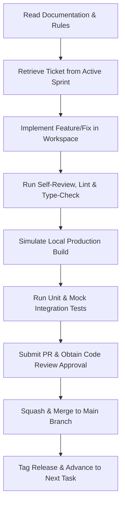

# Phase 11.8 — Developer Playbook

**Project Name:** LifeGuide AI – Career & Learning Copilot  
**Author:** Staff Software Engineer & Engineering Manager, Vercel  
**Version:** 1.0  
**Status:** Phase 11.8 — Developer Playbook  
**Target Audience:** Software Engineers, AI Coding Agents, and Code Reviewers

---

# 1. Project Mission

**LifeGuide AI** is an AI-powered Career & Learning Copilot built to bridge the widening gap between academic or self-guided education and the real-world engineering and management demands of the modern job market.

```
   [Academic/Self Learning] ---> [ LifeGuide AI Copilot ] ---> [ Real-World Employment ]
   (Choice Overload & Theory)      (Assessment & Roadmaps)       (Verified Competency)
```

### Target Users

- **University & College Students:** Final-year or recent graduates who possess theoretical fundamentals but lack real-world internship experiences, practical project architectures, and high-impact portfolios.
- **Job Seekers (Unemployed/Underemployed):** Individuals actively applying for roles who face high resume rejection rates, need to objectively identify skill gaps, optimize resumes for ATS systems, and build confidence for technical and behavioral loops.
- **Career Changers:** Working professionals transitioning from non-technical roles (e.g., retail, sales, operations) into tech sectors, heavily constrained by study availability (typically <10 hours/week) and requiring high-efficiency learning structures.

### Business Problem Solved

Traditional education is slow, costly, and heavily focused on theory. Conversely, online platforms overwhelm learners with generic courses ("choice paralysis") and guide them to build identical, basic portfolios (e.g., Todo lists) that fail to impress recruiters.

LifeGuide AI transforms career transitions into structured, objective, and executable journeys by:

1.  **Objectively assessing** current skills via diagnostic profiling.
2.  **Mapping** optimized, personalized learning roadmaps linked to verified, free resources.
3.  **Generating** non-trivial, custom portfolio project specifications tailored to the learner's skill gap.
4.  **Simulating** interviews and optimizing resumes to maximize placement rates.

### Success Metrics (What Success Looks Like)

- **Engagement:** Over 45% of weekly active users (WAU) actively checking off milestones and updating their progress metrics.
- **Conversion:** A trial-to-paid conversion rate of >3% for premium subscriptions.
- **Outcomes:** Over 60% of premium users securing a relevant job or internship within 180 days of active platform use.
- **Reliability:** Maintaining a >98% success rate in receiving valid, non-corrupted JSON structures from AI API endpoints.

---

# 2. Product Goal

The official scope of LifeGuide AI is frozen around the core learning and preparation loop. No feature should move outside these boundaries without updating the official project scope first.

```
+---------------------------------------------------------------------------------+
|                                 LIFEGUIDE AI                                    |
+---------------------------------------------------------------------------------+
|  [Career Assessment] --> [AI Learning Roadmap] --> [Portfolio Projects Spec]   |
|                                                                                 |
|                   [Resume Analysis] <--> [Mock Interviews]                      |
+---------------------------------------------------------------------------------+
```

LifeGuide AI helps students and career changers become job-ready strictly through:

- **Career Assessment:** Diagnostic questionnaires to evaluate baseline capabilities and identify skill gaps across three core tracks: Frontend Engineering, Backend Engineering, and Product Management.
- **Personalized AI Learning Roadmap:** Step-by-step weekly milestones matching the user's hourly constraints and utilizing verified, free external learning materials.
- **Resume Analysis:** Evaluating uploaded resumes against target job descriptions, providing an ATS compatibility score, and suggesting keyword optimizations.
- **Mock Interview:** Interactive, text-based multi-turn technical and behavioral simulations culminating in a detailed scorecard.
- **Progress Tracking:** Visual trackers, completion percentages, and dynamic roadmap recalculations to maintain momentum.

---

# 3. Engineering Principles

Every engineer and AI coding agent must prioritize these principles. They are not guidelines; they are operational laws designed to protect code quality, velocity, and maintainability.

| Principle                        | Description                                                                       | Why It Is Mandatory                                                                                                                          |
| :------------------------------- | :-------------------------------------------------------------------------------- | :------------------------------------------------------------------------------------------------------------------------------------------- |
| **Simplicity First**             | Prefer simple, readable, and standard code over clever or complex abstractions.   | Complexity breeds bugs, slows onboarding, and makes code reviews painful. Standard patterns are easier for AI agents and humans to maintain. |
| **Quality Over Speed**           | Never rush features at the expense of type safety, tests, or documentation.       | Debt accumulated today is paid back with interest tomorrow. Speed is a byproduct of high quality, not a shortcut.                            |
| **Build Approved Features Only** | Implement only what is explicitly defined in the current sprint scope.            | Speculative development (YAGNI) bloats the codebase, wastes tokens, and risks breaking core architecture.                                    |
| **One Task at a Time**           | Focus on exactly one task, pull request, and commit at a time.                    | Multi-tasking fragments focus, increases cognitive load, and leads to messy git histories and conflict-ridden rebases.                       |
| **Never Skip Architecture**      | Adhere strictly to the defined Clean Architecture and modular boundaries.         | Allowing presentation layers to query database models directly or bypassing repository patterns destroys structural integrity.               |
| **Never Bypass Review**          | Every line of code must be reviewed, linted, compiled, and tested before merging. | Bypassing review introduces runtime regressions and compromises the integrity of our production environment.                                 |
| **Zero TypeScript Errors**       | Compiles must resolve with zero warnings and zero typescript errors.              | TypeScript is our primary line of defense. Ignoring types or resorting to explicit `any` compromises the safety of the entire application.   |
| **Zero ESLint Errors**           | The codebase must pass all configured lint rules on every commit.                 | Automated style checks prevent code drift, enforce modern standards, and prevent common runtime bugs (e.g., circular dependencies).          |

---

# 4. Version Strategy

To enforce timeline controls and ensure steady delivery, the roadmap is divided into structured versions.

```
   +-------------------+      +-------------------+      +-------------------+      +-------------------+
   |   Version 1.0     |      |   Version 1.1     |      |   Version 1.2     |      |   Version 2.0     |
   |      (MVP)        | ---> | (Resume & Match)  | ---> | (Mock Interview)  | ---> | (Enterprise Scale)|
   | Core Learning Loop|      | ATS Compatibility |      | Chat Simulator    |      | Voice, Marketplace|
   +-------------------+      +-------------------+      +-------------------+      +-------------------+
```

### Version 1.0 (MVP) — The Core Learning Loop

Enables baseline profiling, path curation, and onboarding tracking:

- **Authentication:** Better Auth with Google/GitHub OAuth integrations.
- **Landing Page:** Value proposition, track previews, conversion CTAs.
- **User Onboarding:** Wizard for track selection, availability settings, and career goals.
- **Dashboard:** Milestone tracking, active streaks, and completion analytics.
- **Skill Assessment:** 5-10 track-specific diagnostic questions and competency matrix generation.
- **AI Career Roadmap:** Step-by-step custom roadmaps with verified external links.
- **AI Project Recommendation:** Skill-gap-targeted portfolio blueprints (business cases, user stories, architecture suggestions).
- **Progress Tracking:** Progress bars, check-off tasks, dynamic schedule recalibrations.
- **Settings:** Profile updates, OAuth linkage, and account reset/deletion.
- **Responsive Design:** Flawless visual styling from mobile breakpoints (320px) to desktop (1440px+).

### Version 1.1 — Resume Integration & Job Matching

Adds resume analysis and optimization pipelines:

- **Cloudinary Integration:** Secure client-side uploads of PDF resumes (max 5MB) utilizing secure server signature generation.
- **Resume Parser:** AI extraction of skills, projects, and work history.
- **ATS Matching Score:** Real-time alignment checks (0-100%) against job descriptions.
- **Gap Optimization:** Missing keyword listings and actionable bullet-point recommendations.

### Version 1.2 — Interactive Mock Interviews

Introduces the validation loop:

- **Text-Based Mock Coach:** Interactive multi-turn chat cockpit simulating frontend, backend, or PM interview tracks.
- **Dynamic Evaluator:** Analysis of technical correctness, communication structure, and logic.
- **Evaluation Scorecard:** Skill matrix scoring out of 100 with targeted feedback.
- **Competency Sync:** Auto-updating user profile competencies based on interview scores.

### Version 2.0 — Collaboration, Automation, & Recruiter Marketplace

Expands the platform to enterprise and collaborative loops:

- **Voice AI Interview Coach:** Audio-first mock interviews evaluating pacing and filler-word usage.
- **GitHub Portfolio Auditor:** Scanning code quality, folder structures, and tests directly from GitHub APIs.
- **Squad Matches:** Grouping a PM, Frontend, and Backend developer to collaborate on dynamic portfolio projects.
- **Verified Talent Marketplace:** Recruiter dashboards with candidate filters based on objective competency scores.
- **Stripe Premium Billing:** Integrated subscription gates for unlimited roadmaps and simulator access.

---

# 5. Sprint Strategy

Development operates on **2-week (10 working days) sprints**. The process is structured to enforce predictable velocity and clean releases.

```
Day 1                     Days 2-9                       Day 10 (AM)     Day 10 (PM)
+-----------------------+ +----------------------------+ +-------------+ +---------------+
|    Sprint Planning    | |      Sprint Execution      | |   Sprint    | |  Retrospective|
|  - Set Sprint Goal    | |  - Daily Standups (15m)    | |   Review    | |  - Process check|
|  - Refine Backlog     | |  - Developer Task Loops    | |  - Demo     | |  - Action items |
+-----------------------+ +----------------------------+ +-------------+ +---------------+
```

- **Sprint Planning (Day 1):** The team reviews the Product Backlog, selects items that meet the **Definition of Ready (DoR)**, defines a clear Sprint Goal, breaks stories down into tasks using the Task Template, and assigns them to developers.
- **Sprint Execution (Days 2-9):**
  - _Daily Standup (15 mins):_ Focused strictly on: What did I complete yesterday? What am I working on today? What are my blockers?
  - _Execution Loop:_ Developers work on one task at a time, moving it from `Todo` to `In Progress` to `Review` and `Done` using the Task Workflow.
- **Sprint Review (Day 10 - Morning):** A showcase of working software deployed to a staging environment. Verify that the work matches the target Sprint Goal.
- **Sprint Completion (Day 10 - Mid-day):** Clean up the sprint board. Verify all items meet the **Definition of Done (DoD)**. Compile release notes and tag the production branch (`vX.Y.Z`).
- **Sprint Retrospective (Day 10 - Afternoon):** Focus on team improvement: What went well? What didn't go well? What processes can we optimize? Assign clear action items for the next sprint.

---

# 6. Master Development Tracker

Progress is tracked using explicit markdown checklists. No feature is marked complete unless all tasks within it pass verification.

# Sprint 1 — Foundation

Status:
Completed

Progress:
11 / 11 Tasks Completed

Checklist

- [x] Create Next.js Project
- [x] Configure TypeScript
- [x] Install Dependencies
- [x] Configure Tailwind CSS
- [x] Configure ESLint
- [x] Configure Prettier
- [x] Setup Folder Structure
- [x] Configure Path Aliases
- [x] Setup Environment Variables
- [x] Configure Git
- [x] First Commit

This tracker will be updated during development.

---

# 7. Task Workflow

This workflow is the absolute execution loop. Developers and AI agents must follow every step in order. **Do not execute steps in parallel or skip checkpoints.**

```
+------------+      +---------------+      +---------------+      +-----------------+
|   1. Read  | ---> | 2. Understand | ---> |  3. Implement | ---> | 4. Self Review  |
+------------+      +---------------+      +---------------+      +-----------------+
                                                                           |
                                                                           v
+------------+      +---------------+      +---------------+      +-----------------+
|  8. Commit | <--- |   7. Build    | <--- |   6. ESLint   | <--- |  5. Type Check  |
+------------+      +---------------+      +---------------+      +-----------------+
      |
      v
+------------+
|  9. STOP   | (Wait for explicit user approval / Peer Review before starting next task)
+------------+
```

1.  **Read:** Open and read all requirements, templates, database schemas, and architectural files related to the task.
2.  **Understand:** Verify you have all context. Confirm you know:
    - Which files need to be created or modified.
    - The exact acceptance criteria.
    - The folder structure boundaries (e.g., placing UI in `features`, models in `database`).
3.  **Implement:** Write clean, minimal, and fully typed code. Follow the Design System tokens and Import Rules strictly.
4.  **Self Review:** Review your own code diffs line-by-line. Confirm no debug logs, placeholders, or cross-feature imports are left behind.
5.  **Run Type Check:** Execute standard TypeScript compilation verification in the terminal:
    ```bash
    npm run type-check
    ```
6.  **Run ESLint:** Verify style compliance:
    ```bash
    npm run lint
    ```
7.  **Run Build:** Run a local production-grade build to confirm compile safety:
    ```bash
    npm run build
    ```
8.  **Update Checklist:** Check off completed tasks in the Master Development Tracker.
9.  **Git Commit:** Commit changes following the Git Workflow.
10. **STOP:** Terminate your active execution loop. Do not proceed to the next task until the current commit is reviewed, verified, or approved by the user.

---

# 8. Task Template

Every task ticket must be formatted using this template. Copy and paste this directly when creating tasks in the tracker.

```markdown
### Task ID: `TSK-XXX-NNN`

- **Title:** [Clear, brief action-oriented description]
- **Goal:** [What this task is trying to accomplish]
- **Business Value:** [Why this task matters to the user or the business]
- **Dependencies:** [List other Task IDs or schema validations that must be merged first]
- **Files to Create:**
  - `[NEW] [filename](src/path/to/newfile)`
- **Files to Modify:**
  - `[MODIFY] [filename](src/path/to/modifiedfile)`
- **Acceptance Criteria:**
  - [ ] AC-1: [Specific validation or UI behavior]
  - [ ] AC-2: [Specific API response payload schema]
- **Definition of Done (DoD) Checks:**
  - [ ] Compiles successfully without warnings/errors.
  - [ ] Lint checks pass cleanly.
  - [ ] UI is responsive across desktop, tablet, and mobile breakpoints.
  - [ ] Key helper functions are unit tested.
- **Estimated Time:** [e.g., 4 Hours]
- **Commit Message:** `type(scope): conventional commit message`
```

---

# 9. Definition of Done (DoD)

A task is considered complete and ready for pull request review **only** if it satisfies the following checklist:

- [ ] **Feature Works:** The code meets all functional requirements and acceptance criteria specified in the task card.
- [ ] **No TypeScript Errors:** Compilation completes cleanly with zero errors or explicit warnings. Explicit `any` is prohibited.
- [ ] **No ESLint Errors:** The codebase passes all configured lint parameters (including import ordering and circular dependency checks).
- [ ] **Build Succeeds:** Running `npm run build` completes successfully.
- [ ] **Responsive Design:** UI layouts are verified across all targeted breakpoints:
  - _Mobile:_ 320px - 480px
  - _Tablet:_ 768px - 1024px
  - _Desktop:_ 1200px - 1440px+
- [ ] **Accessibility (a11y):** Core components use HTML5 semantic tags, include screen-reader labels (`aria-label`), image `alt` attributes, and meet WCAG AA contrast rules.
- [ ] **Checklist Updated:** The Master Development Tracker is updated, and the task is checked off.
- [ ] **Commit Prepared:** The changes are committed to the local branch using the proper commit naming structure.

---

# 10. Definition of Ready (DoR)

A backlog item can be moved to the active sprint board and started **only** if it meets these guidelines:

- [ ] **Goal Understood:** The business goal and functional requirements of the feature are fully understood.
- [ ] **Architecture Reviewed:** The proposed folder path and dependency flow are verified to follow the Import Rules.
- [ ] **UI Spec Reviewed:** Component layouts, Tailwind v4 design tokens, and micro-animations are finalized.
- [ ] **API Spec Reviewed:** Route Handler inputs, outputs, and Zod schemas are defined.
- [ ] **Database Design Reviewed:** Mongoose schemas, collection indexes, and relation structures are approved.
- [ ] **Dependencies Ready:** All prerequisite library installs and preceding task tickets have been merged.
- [ ] **Current Sprint Ready:** The item has been formally sized, assigned a Task ID, and placed in the active sprint.

---

# 11. Git Workflow

We use a clean, linear git strategy. Force pushing to shared branches and committing direct code to main without a pull request is strictly forbidden.

```
       +-------------------------------------------------+
       |                    main branch                  |
       +-------------------------------------------------+
          ^                                           | (Checkout)
          |                                           v
       +-------------------------------------------------+
       |      feat/LG-101-auth-oauth (Feature Branch)    |
       +-------------------------------------------------+
          |                                           ^
          | (Code, Test, Lint, Build)                 | (Rebase/Update)
          v                                           |
       [ Pull Request -> Peer Review -> Squash & Merge ]
```

### Branch Naming Convention

Branches must be named using the format: `type/ticket-id-short-description`.

- **Types:**
  - `feat/`: New feature implementations.
  - `fix/`: Bug fixes.
  - `docs/`: Documentation additions or changes.
  - `refactor/`: Code reorganization without behavior change.
  - `test/`: Creating unit or integration tests.
  - `ci/`: Build pipeline configuration updates.
- **Examples:**
  - `feat/LG-101-auth-oauth-google`
  - `fix/LG-204-db-lean-query`
  - `docs/LG-08-update-dev-playbook`

### Commit Convention (Conventional Commits)

Commits must follow the Conventional Commits specification: `type(scope): description`.

- **Types:** `feat`, `fix`, `docs`, `style`, `refactor`, `perf`, `test`, `build`, `ci`, `chore`.
- **Scope:** The specific feature folder or module name (e.g., `auth`, `roadmap`, `db`, `ai`).
- **Examples:**
  - `feat(auth): add google oauth flow with session hook`
  - `fix(db): add lean queries to avoid mongoose hydration overhead`
  - `docs(onboarding): clarify availability slider boundaries`

### Pull Request Flow

1.  **Sync Local:** Rebase your branch against the latest target branch before pushing.
    ```bash
    git fetch origin
    git rebase origin/main
    ```
2.  **Push Branch:** Push feature branch to remote.
    ```bash
    git push origin feat/LG-101-auth-oauth-google
    ```
3.  **Open PR:** Create a PR on GitHub. Include:
    - A link to the related Task ID.
    - A brief summary of changes.
    - Before/after screenshots or UI screen recordings for layout alterations.

### Merge Rules

- **CI Gate:** All automated checks (linting, type-checking, building, unit tests) must pass.
- **Peer Review:** Requires at least 1 approved review from an engineering teammate.
- **Clean History:** Use **Squash and Merge** (or rebase merge) to ensure the commit history on `main` remains linear and clear.

### Release Strategy

Releases are marked with semantic versioning tags (`vMajor.Minor.Patch` - e.g., `v1.0.0`, `v1.1.0`). Deployments compile to Vercel production platforms automatically upon tagging and merging to `main`.

---

# 12. Code Review Workflow

Code reviews are a collaborative verification process to ensure clean architectures, catch logic regressions, and align implementation choices.

```
+---------------+      +---------------+      +---------------------+      +---------------+
| 1. Self Review| ---> | 2. Peer Review| ---> | 3. Arch/Checklist   | ---> | 4. Approval & |
|  - Check diff |      |  - Logic check|      |    Compliance       |      |     Merge     |
|  - Run local  |      |  - QA features|      |  - Verify boundaries|      |  - CI passes  |
+---------------+      +---------------+      +---------------------+      +---------------+
```

1.  **Self Review:** Before requesting feedback, the developer reviews their own code diff. Check that:
    - All console logs and temporary mock variables are removed.
    - No circular dependencies or unauthorized layer imports are present.
2.  **Peer Review:** The reviewer evaluates the code against these checkpoints:
    - _Logic correctness:_ Does the code fulfill the acceptance criteria safely?
    - _Edge Cases:_ Are external API call failures, empty states, and invalid inputs handled gracefully?
    - _DRY principle:_ Are there redundant schemas or duplicated helper functions?
3.  **Architecture & Checklist Compliance:** Reviewers verify strict architectural alignments:
    - _Verification 1:_ Feature folders must not contain database models.
    - _Verification 2:_ Client components (using `'use client'`) must not import database models or private server configurations.
    - _Verification 3:_ PR includes new unit tests for modified services or utilities.
4.  **Approval & Merge:** Once the review is approved, all checks are green, and the checklist matrices are verified, the author squashes and merges the branch into `main`.

---

# 13. AI Coding Agent Rules

All AI agents (including Antigravity) must follow these operational guidelines. **No exceptions.**

- **Read Before Writing:** The AI agent must read all relevant project rules, architectural designs, API schemas, and folder strategies before writing code.
- **Never Skip Tasks:** Complete tasks in order. Do not skip tickets or push incomplete placeholders.
- **Complete Exactly One Task:** The agent must focus on and complete exactly one task per turn/session. Do not bundle multiple tickets into a single coding pass.
- **Update the Tracker:** The agent must update the active task checklist in the `task.md` or playbook tracker, moving items to completed `[x]`.
- **Suggest a Commit:** Upon completing a task, the agent must suggest a clean, conforming commit message and conventional format for the user to review.
- **STOP After Each Task:** The agent must stop execution immediately after completing one task. It must wait for the user to verify, approve, and commit the changes before requesting the next assignment.
- **Never Generate Future Tasks:** Do not speculatively create future task lists, files, or tickets unless explicitly directed by the project lead.
- **Never Alter Architecture without Approval:** The agent must strictly respect layer boundaries. Never create new folders, databases, or API structures without explicit consent.
- **Never Invent Features:** Focus strictly on the defined acceptance criteria. Do not add unapproved features or styling variants.

---

# 14. Build Workflow



---

# 15. Risk Management

We manage software quality and development velocity by tracking and mitigating core technical risks.

### Scope Creep

- _Risk:_ Squeezing undocumented or unapproved features ("polishing", "nice-to-haves") into active tasks, causing delays.
- _Mitigation:_ Strict adherence to the Version Strategy and MVP Scope. If a feature is not in the active roadmap, it is rejected. All scope changes require an official PRD update before coding.

### Technical Debt

- _Risk:_ Using quick fixes, skipping type validations, or neglecting tests to hit dates.
- _Mitigation:_ Mandatory linter and compiler enforcement in the CI loop. All PRs must meet the Definition of Done.

### Breaking Architecture Boundaries

- _Risk:_ Intermixing presentation logic with database models or causing circular import loops.
- _Mitigation:_ Rigid enforcement of the Import Rules. Running automated ESLint `no-cycle` checks on builds.

### Rollover Tasks

- _Risk:_ Tasks remaining in progress across multiple sprints due to poor sizing or unexpected blockers.
- _Mitigation:_ Sizing stories before sprints. If a task is larger than 8 hours, it must be decomposed into smaller, isolated task units.

### Skipped Reviews

- _Risk:_ Merging code directly to speed up hotfixes or deployment timelines.
- _Mitigation:_ Branch protection rules on GitHub. Direct pushes are blocked, and merges are protected by mandatory CI runs.

---

# 16. Progress Reporting

We maintain progress visibility through clear daily and periodic checkpoints.

```
       [ Daily Progress ] ---> [ Sprint Summary ] ---> [ Module/Version Release ]
         (Slack/Discord)         (Retro Demo)             (Production Tags)
```

- **Daily Progress:** Developers post asynchronous updates detailing task updates, active blockers, and upcoming actions in shared communication channels.
- **Sprint Summary:** Presented on the final day of each sprint. Measures velocity, lists completed backlog items, and demos new capabilities on staging.
- **Module Completion:** Marked when all features inside a feature domain (e.g., `src/features/auth`) are validated and merged.
- **Version Completion:** Concludes major milestones (e.g., v1.0, v1.1). Includes a full suite of manual tests, production deployments, and a public changelog.

---

# 17. Final Developer Promise

We pledge our alignment to high-quality software engineering:

> "We build software deliberately.  
> We prioritize quality over speed.  
> Every task has a defined purpose.  
> Every commit has clear value.  
> Every feature solves a real problem.  
> We protect the architecture, respect the rules, and write code that lasts."

---

Version: 1.0  
Status: Phase 11.8 — Developer Playbook
